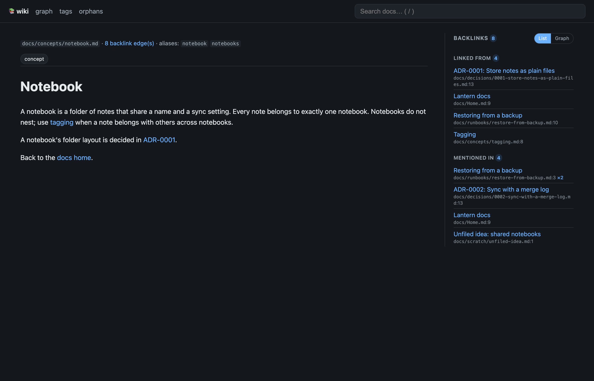
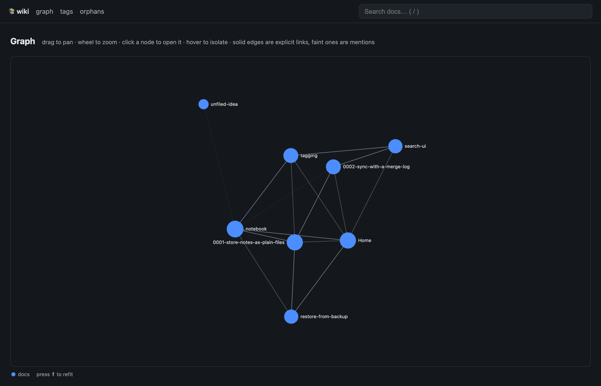

# docs-wiki

Long-term working memory for your project. Your agents write down decisions, concepts and how-tos as they build; you browse and read all of it in a local web UI.



It is plain markdown in your repo, so nothing is locked away. Backlinks, full-text search, link checking and a graph are how it stays useful as it grows: every page shows who links to it, broken links fail a check, and you can see how it all connects. No database, zero runtime dependencies, and it never leaves your machine: the web UI listens on `127.0.0.1` only.

## Set it up with your agent

Paste this into your coding agent, and it will wire the repo up, including the instructions future sessions read:

```
Set up docs-wiki in this repo as our long-term working memory:
1. Run `npx docs-wiki init --dry-run`, then `npx docs-wiki init` (add `--claude` if you are Claude Code). Read every line it prints; if it exits 2, fix what it refused and run it again — but if fixing it means changing a file you did not create (permissions, links, existing pages), ask me first.
2. Run `npx docs-wiki check` and fix anything it enforces.
3. Commit the result.
4. Tell me what it wrote.
From now on, follow the docs-wiki section in AGENTS.md.
```

`init` adds a docs-wiki section to `AGENTS.md` (and links `CLAUDE.md` to it for Claude Code), the seed skills and personas, and a starter `docs/Home.md`. It never overwrites what you have changed, so re-running it is safe.

## Install

You need Node 22 or newer. Pick one:

```sh
npx docs-wiki              # run without installing
npm i -D docs-wiki         # add it to a project
```

Or clone this repository and run it from source (no build step, no install):

```sh
node --experimental-strip-types src/cli.ts serve --root /path/to/your/repo
```

docs-wiki has no runtime dependencies, so there is nothing else to install.

## Quick start

Run these inside a git repo that has some markdown (if you installed with `npm i -D`, `npx` finds the local copy):

```sh
npx docs-wiki init                   # wire the repo up for your agents
npx docs-wiki serve                  # browse at http://127.0.0.1:8123
npx docs-wiki check                  # lint links; exit 1 on broken ones
npx docs-wiki search "sync" tag:adr  # full-text search, optionally by tag
npx docs-wiki backlinks docs/Home.md # who links to this page?
```

Want to see it first? There is a small invented wiki in this repo:

```sh
npx docs-wiki serve --root examples/demo-wiki
```

`check` prints one finding per line and exits 0 when nothing is enforced, 1 when something is broken, and 2 on a usage error. Broken links, broken `[[wikilinks]]`, ambiguous references, duplicate aliases and broken anchors are errors; orphan pages, long pages and dead mentions are only reported.

## Graph view

The graph shows how your pages link to each other, so clusters and loners stand out.



## Use it with your AI agent

docs-wiki works with any agent that can run a shell command. The [agents guide](agents/README.md) tells an agent how to set docs-wiki up in a repo, and [agents/setup.md](agents/setup.md) walks through it step by step, including what to do about each finding. If you would rather wire it by hand, the guide has the snippet `init` writes, to paste into your `AGENTS.md`, `CLAUDE.md` or similar instruction file.

## More

- [Commands, finding codes and exit codes](docs/commands.md)
- [Configuration (`docs-wiki.config.json`)](docs/configuration.md)
- [Library API](docs/library-api.md), for embedding the engine in your own app
- [Skills and personas](docs/skills-and-personas.md): seed pages that teach an agent how to look after a docs corpus
- [Security policy](SECURITY.md)

## Develop

```sh
pnpm install
pnpm vitest run     # tests
pnpm typecheck
pnpm build          # compile dist/ for publishing
```

## License

MIT. See the `LICENSE` file.
